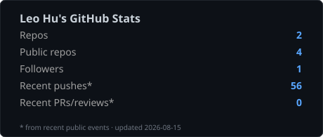
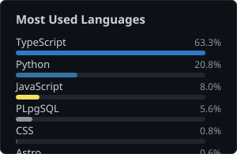



  

 

<h1 align="center">Leo Hu</h1>

  <strong>AI Engineer · Quant Systems · Open Source</strong>

  做 <strong>AI × 美股量化</strong>：把研究、回测、模拟盘和实盘链路做成一个人能跑通的系统。 
  关注可复现的研究流程、硬风控，以及能真正上线的工程交付。

  <em>Building at the intersection of AI and US equities — research desks, agent systems, and trading infrastructure one person can actually run.</em>

  
  
  

---

### About

- **QuantDesk** — 开源美股个人量化台：研究 → 假 alpha 淘汰 → 模拟盘 → IBKR 实盘链路  
  → [`leohux/quantdesk-oss`](https://github.com/leohux/quantdesk-oss)
- **VisionDesk-AI** — 本地优先的桌面视觉智能体（YOLO + VLM）  
  → [`leohux/VisionDesk-AI`](https://github.com/leohux/VisionDesk-AI)
- **Agents** — 产品分析 / 研究助手类 LLM agent 小项目  
  → [`leohux/pen-x1-agent`](https://github.com/leohux/pen-x1-agent)

我更关心三件事：**假信号能不能被闸门杀掉**、**系统在异常时会不会乱下单**、**一人能不能维护整条链路**。

---

### Tech Stack

**Languages**

**AI / Data**

**Systems**

---

### Featured Projects

**[QuantDesk](https://github.com/leohux/quantdesk-oss)** — 美股量化台（公开去敏版）  
一人可跑通的研究 → 模拟 → 实盘栈；带 alpha-wash 闸门与 React 控制台。  
`Python` · `FastAPI` · `React` · `Docker` · `IBKR`

**[VisionDesk-AI](https://github.com/leohux/VisionDesk-AI)** — 本地桌面视觉 Agent  
实时检测 + VLM 推理，强调本地可运行、过程可检查。  
`Python` · `YOLO` · `VLM` · `Gradio`

**[PEN-X1 Agent](https://github.com/leohux/pen-x1-agent)** — 产品分析 Agent Demo  
线性流水线 + Streamlit 界面。  
`Python` · `Streamlit` · `LLM`

---

### Stats

  
  

  

 

  <i>Build things that survive contact with reality.</i>

